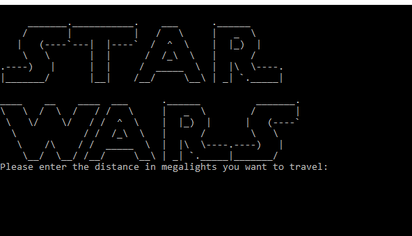

# StarWars

## Project Overview
This project consumes the popular star wars api https://swapi.dev/

I created this project as an excersise in Domain Driven Desgin. 
This was the design approach I took with this project.

The project itself is intened to get the starships data from the api
and for each starship calculate the number of stops it would need to take in order to travel a given distance.

My approach to this was to create a simple console application that would call an Application service within a domain. 

## Running the project
#### Prerequisites

* [Visual Studio](https://visualstudio.microsoft.com)
* [.NET Core SDK](https://aka.ms/dotnet-download)

#### Steps
1. Open **source\StarWars.sln** in Visual Studio.
2. Set **StarWars.ConsoleApp** as startup project.
3. Press **F5**.

## Technologies

* .NET Core 3.1
* C# 8.0
* DependencyInjection
* AutoMapper
* NewtonsoftJson
* RestSharp
* [Coverlet](https://github.com/coverlet-coverage/coverlet)
* Moq
* MSTest

## Practices

* Clean Code
* SOLID Principles
* DDD (Domain-Driven Design)
* Separation of Concerns
* Code Analysis

## Project layout
**Client:** .Net Core Console Application.

**Application:** Flow control.

**Domain:** Business rules and domain logic.

**Infrastructure:** Data transfer objects and api context.
